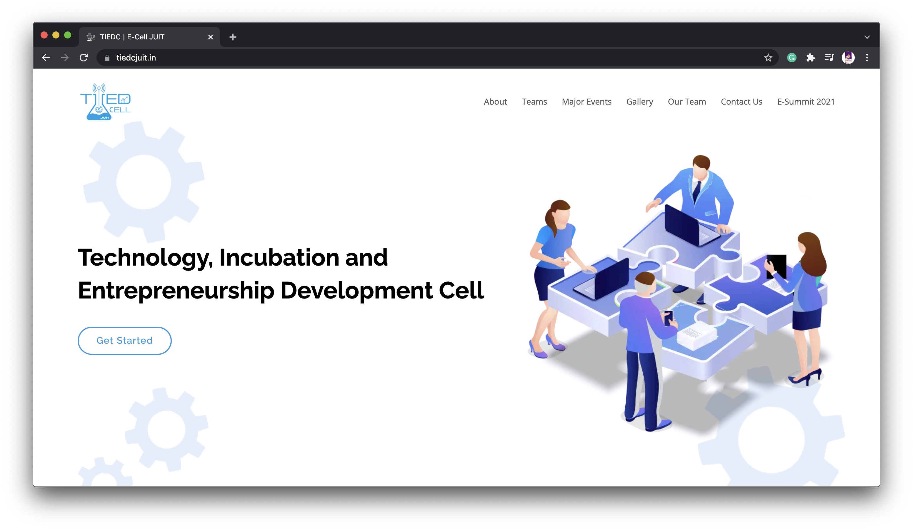
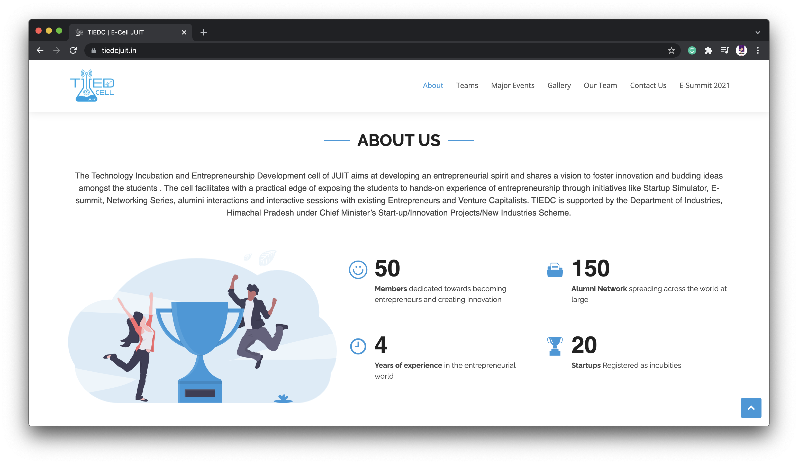

## TIEDC - E Cell of JUIT

### What is TIEDC ?

The Technology Incubation and Entrepreneurship Development cell of JUIT aims at developing an entrepreneurial spirit and shares a vision to foster innovation and budding ideas amongst the students . The cell facilitates with a practical edge of exposing the students to hands-on experience of entrepreneurship through initiatives like Startup Simulator, E-summit, Networking Series, alumini interactions and interactive sessions with existing Entrepreneurs and Venture Capitalists. TIEDC is supported by the Department of Industries, Himachal Pradesh under Chief Minister’s Start-up/Innovation Projects/New Industries Scheme.

[)][2]  [)][4]
